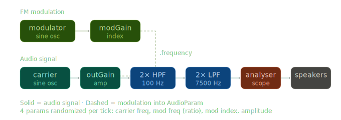

# Lab 3 - Sound Synthesis
Worked solo on Part I (confirmed w/ Mark)

--- 

## Part I: Babbling brook

A WebAudio recreation of this SuperCollider one-liner:
```
{RHPF.ar(LPF.ar(BrownNoise.ar(), 400), LPF.ar(BrownNoise.ar(), 14) * 400 + 500, 0.03, 0.1)}.play
```

### How it works

**Subtractive synthesis** - start with brown noise (contains all frequencies), then sculpt it with filters and modulation

Two independent brown noise sources serve different roles:
- **Audio path**: brown noise --> lowpass @ 400 Hz --> resonant highpass
- **Control path**: brown noise --> lowpass @ 14 Hz --> slow random wobble that modulates the highpass cutoff frequency

The WebAudio trick: `modGain.connect(rhpf.frequency)` routes an audio-rate signal into an AudioParam. The signal gets added to the param's base value every sample. So `modGain.gain = 1500` does the scaling, `rhpf.frequency.value = 500` does the offset, and `.connect()` does the modulation

### Key parameters (tuned by ear)
- Highpass Q: 45
- Modulation gain: 1500
- Modulation rate: 14 Hz

### File
- `babbling_brook.html`

---

## Part II: R2D2 computer babble

A WebAudio implementation of Andy Farnell's R2D2 "computer babble" patch from *Designing Sound* (Practical 34, Chapter 57)

### What it is

A two-operator FM synthesizer whose four parameters get randomly slid, jumped, or held on every metronome tick. The metronome period itself is randomized, so the rhythm feels ever-changing. The result is chattering R2D2-like sounds consisting of pitch sweeps, modulation sweeps, breaks of calling, etc.

### How to run

Open `r2d2.html` in a modern browser. Click **Start**. Adjust the sliders:
 
- **Talk speed** -- base metronome period (slow = contemplative R2, fast = panicked R2)
- **P(slide)** -- probability of a smooth slide to a new value
- **P(jump)** -- probability of an instant jump
- Remaining probability = hold (do nothing this tick)

### Audio graph
 
```
modulator (sine osc) --> modGain --> carrier.frequency    <-- FM modulation
                                          │
carrier (sine osc) --> outGain --> hpf1 --> hpf2 --> lpf1 --> lpf2 --> analyser --> speakers
```


*Above visual was created by prompting Claude to make a more compact and readable version of the WebAudio graph (can be seen in webaudio_screenshot.png)*
 
- **FM core**: `modulator --> modGain --> carrier.frequency`. Same `.connect(AudioParam)` trick as Part I -- the modulator's audio signal gets added to the carrier's base frequency every sample.
- **Output chain**: gain --> two highpass @ 100 Hz --> two lowpass @ 7500 Hz --> analyser --> speakers. Doubling each filter doubles the rolloff slope.
- **Analyser**: a passthrough tap before the destination, drives the inline waveform visualizer.

### Per-tick randomization
 
On every metronome beat, four parameters are independently randomized:
 
| Parameter | Range | What it does |
|---|---|---|
| `carrier.frequency` | 200–2500 Hz | Pitch of each chirp |
| `modulator.frequency` | carrier × random(0, 0.5) | Harmonic character; tied to carrier via ratio |
| `modGain.gain` (mod index) | 20–840 | How deeply the modulator bends the carrier |
| `outGain.gain` | 0–0.3 | Per-tick loudness |
 
For each parameter, `pickAction()` rolls dice: **slide** (`setTargetAtTime`), **jump** (`setValueAtTime`), or **hold** (do nothing). The mix of all three across four independent parameters is what makes it sound alive.
 
### Synthesis type: FM
 
**FM (frequency modulation) synthesis**: one oscillator modulates another's frequency fast enough that your ear stops hearing vibrato and starts hearing new harmonics. Three knobs control the character: carrier frequency (pitch), modulator frequency as a ratio of the carrier (where harmonics land), and modulation index (how many harmonics / how harsh).
 
Farnell deliberately pushes the mod index past "musical" ranges to introduce aliasing — *"because it sounds cooler and more technological, that's all."*
 
### Contrast with Part I
 
| | Part I (brook) | Part II (R2D2) |
|---|---|---|
| **Synthesis** | Subtractive (noise --> filter) | FM (sines --> modulate to build harmonics) |
| **Source** | Brown noise (all frequencies) | Two sine oscillators |
| **Complexity from** | Filtering stuff out | Building stuff up via modulation |
| **Expressiveness from** | Modulating the filter cutoff | Randomizing all four synth parameters |
| **Shared trick** | `.connect(AudioParam)` -- routing audio into a parameter | Same |
 
Both use modulation as the expressive engine, but they approach sound from opposite directions.
 
### What I changed from Farnell's patch and why
 
- **Carrier range 200–2500 Hz** (Farnell: 100–9100): the upper end was painfully shrill for sustained listening.
- **Lowpass at 7500 Hz** (Farnell: 10000): tamed harshness further.
- **Sine carrier**: matches Farnell's actual `phasor~ → cos~` implementation (his "303 sawtooth" comment describes what R2 evokes, not what the patch uses).
- **Mod index up to 840**: kept close to Farnell's range to preserve the aliasing character.
- **Added waveform visualizer**: `AnalyserNode` tapped into the signal chain before destination, drawn to a canvas at 60fps. Shows the FM character morphing in real time.
